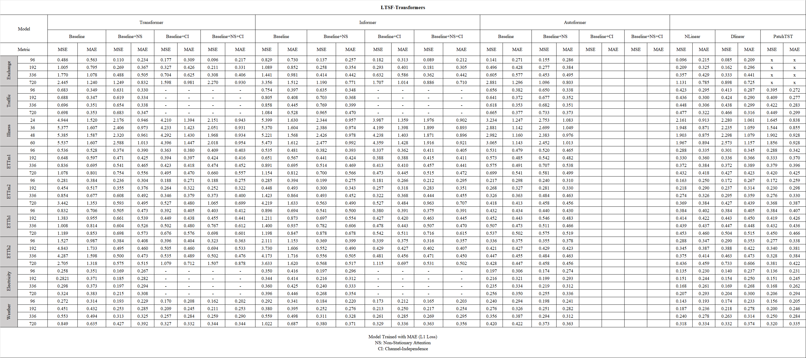

# Research ON Channel Independence

# Introduction

This is an experiment investigating the influence of channel independence on Time Series Forecasting models. Motivated by works done by [Nie et al, 2023](https://arxiv.org/abs/2211.14730) and [Zeng et al, 2023](https://arxiv.org/abs/2205.13504), we have conducted a thorough experiment on “how channel independence can boost performance of LTSF-Transformers” 

[Han et al, 2023](https://arxiv.org/abs/2304.05206) conducted a series of experiment on this subject and concluded that a CI strategy contributes to high forecasting capacity thanks to its robustness to distribution shift. Nonetheless, it implemented CI strategy by simply loading each variable of times series independently. For example, with 32 time series with 5 variables, 160 independent samples are loaded to the dataloader. It might not be fair to compare result derived under such condition to that of LTSF-Transformer since the former is completely univariate. As a result, for fair and robust comparison, we have adapted CI strategy used by [Nie et al, 2023](https://arxiv.org/abs/2211.14730) i.e. [bsz, nvars, seq_len] is reshaped to [bsz x nvars, seq_len, 1]. 

## Experiment Detail

- Work by [Han et al, 2023](https://arxiv.org/abs/2304.05206) suggests Channel Dependence (CD) models tend to perform poorly with a dataset that has severe level of non-stationarity. Therefore, we attempt to compare performance of Non-stationary Transformer [(Liu et al, 2022)](https://arxiv.org/abs/2205.14415) and LTSF-Transformer + CI.
- Inspired by work of [Nie et al, 2023](https://arxiv.org/abs/2211.14730), we removed decoder from LTSF-Transformer. To make a prediction on future steps solely on the encoder, we added Prediction Head at the end of the encoder. In other words, the Prediction head will map the feature from d_model to pred_len. Surprisingly, with the help of CI, encoder only version matches the metrics of PatchTST and NLinear.

The contributions of this experiment lie in Three folds:

1. When used with CI, Transformer encoder on its alone has strong forecasting capacity.
2. Channel Independence can boost model capacity significantly.
3. Current CI methods are inefficient in terms of Training time and computational cost
4. Using Mean Absolute Error (MAE) for training loss function helps boosting forecasting performance, as suggested by [Han et al, 2023](https://arxiv.org/abs/2304.05206). 

---

## Main Result

**Trained with MAE loss**



**Trained with MSE loss**


### *When used with CI, Transformer encoder on its alone has strong forecasting capacity*

- Baseline+CI and Baseline+CI+NS models are one that only used encoder. In most of the cases, CI strategy boosted baseline performance by significant scale.

### *Channel Independence can boost model capacity significantly.*

 ](./img/Untitled%202.png)

[(Liu et al, 2022)](https://arxiv.org/abs/2205.14415) 

- LTSF with CI strategy retained much improved results along all dataset. It is worth noticing that with highly non-stationary dataset such as Exchange and illness, using Non-stationary Transformer and CI startegy all together resulted the best metrics.
- In such non-stationary cases, implementing subtract_last strategy, a protocol that subtracts each lookback windows by its last values. LSTF-Transformer with CI+NS+subtract last strategy altogether managed to outperform both NLinear and PatchTST in Exchange and illness dataset.

### *Current CI methods are inefficient in terms of Training time and computational cost*

- Dashed results are failed ones due to memory loss.
- CI strategy alone consumes significant amount of memory. While PatchTST consumes a bit less, thanks to patching strategy, still requires large computational cost.
- N-Linear requires much less computational cost with forecasting performance compatible to PatchTST and CI_Transformers. As a result

### *Using Mean Absolute Error (MAE) for training loss function helps boosting forecasting performance, as suggested by [Han et al, 2023](https://arxiv.org/abs/2304.05206).*

- Model trained with MSE loss consistently recorded lower MAE and MSE evaluation loss for highly non-stationary dataset (Exchange)
- For the less non-stationary dataset, training model with MSE loss resulted in a better result.

Further Ablation to be uploaded…

---

## Environment

### Docker environment

- [nvcr.io/nvidia/pytorch:22.12-py3](https://catalog.ngc.nvidia.com/orgs/nvidia/containers/pytorch/tags)

### GPU

- Titan RTX D6 24GB x 4 EA

To reproduce this experiment

1. Download [datasets](https://drive.google.com/drive/folders/1ZOYpTUa82_jCcxIdTmyr0LXQfvaM9vIy). Create a seperate folder `./dataset` and put all the csv files in the directory.
2. run files in /scripts folder

```jsx
bash ./scripts/run_all.sh
```
